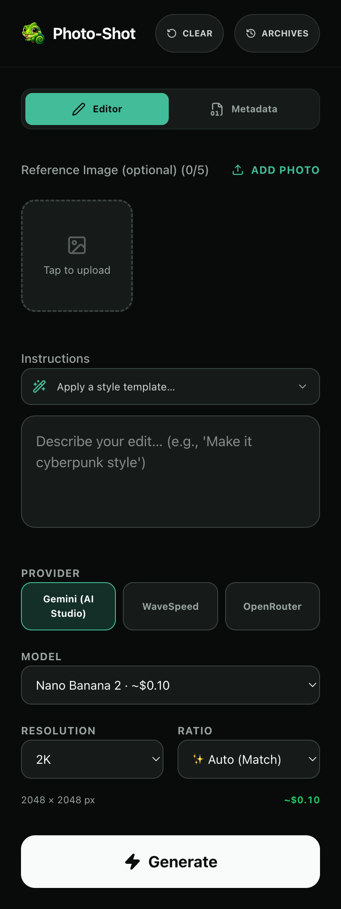
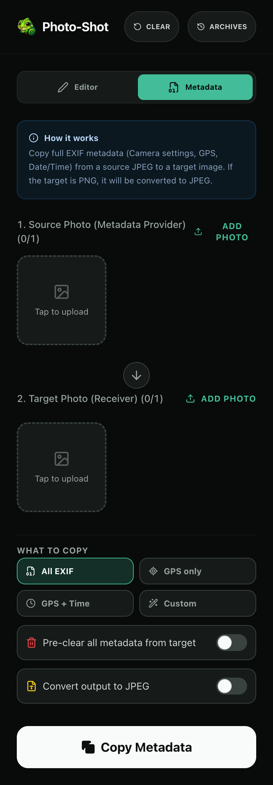

<p align="center">
  
</p>

<h1 align="center">Photo-Shot</h1>

<p align="center">
  A mobile-first, self-hosted AI image studio for editing, upscaling and metadata.
</p>

<p align="center">
  <a href="LICENSE"></a>
  
  
  
  
</p>

<p align="center">
  <a href="#highlights">Highlights</a> ·
  <a href="#features">Features</a> ·
  <a href="#using-photo-shot">Using Photo-Shot</a> ·
  <a href="#self-hosting">Self-hosting</a> ·
  <a href="#security--privacy">Security &amp; privacy</a> ·
  <a href="#development">Development</a>
</p>

Photo-Shot brings image creation, image editing, dedicated upscaling and EXIF
metadata tools into one focused interface. It supports multiple AI providers,
shows only the controls each model actually understands and keeps provider keys
on your server.

<p align="center">
  
  &nbsp;&nbsp;
  
</p>

## Highlights

**One studio, three providers.** Choose between fal.ai, WaveSpeed and
OpenRouter without learning a different interface for every service. Providers
without a configured key remain visible but disabled.

**Controls that follow the model.** Aspect ratios, resolutions, reference-image
limits, output formats and advanced settings change with the selected model.
Photo-Shot also shows an estimated price and output size before generation.

**Purpose-built upscaling.** Crystal Upscaler exposes scale factor and
creativity. SeedVR2 offers upscale factor or target resolution plus adjustable
noise, with the supported output formats for each model.

**Metadata without a separate desktop tool.** Copy all EXIF data, GPS only,
GPS and time, or a custom selection from one photo to another. Metadata work is
performed locally in the browser.

**Results that follow you.** Generated images, prompts and cost information are
kept in a shared 90-day history on your server. Download, share or re-edit a
result directly from the app.

**Made for mobile.** Photo-Shot is an installable PWA with safe-area support,
HEIC conversion and familiar pull-to-refresh behaviour. Its app shell remains
available offline; AI generation still requires a network connection.

## Features

### Image creation and editing

- Text-to-image and image-to-image workflows with up to five reference images,
  depending on the selected model.
- Prompt templates for common edits and styles, plus a one-tap re-edit flow.
- Model-specific ratios and resolutions, including 2K, 3K, 4K and selected 8K
  outputs where the provider supports them.
- Advanced options such as output quality and format, web or image search and
  OpenRouter FLEX processing.
- Optional transfer of GPS and time metadata from a reference image to a
  generated result.

### Upscaling

- **Crystal Upscaler:** 1–200× scale factor, creativity from 0–10 and JPEG or
  PNG output.
- **SeedVR2 Upscaler:** 1–10× upscale factor or 720p, 1080p, 1440p and 2160p
  target resolutions, adjustable noise and JPEG, PNG or WebP output.

### Results, history and costs

- Live estimated cost and output dimensions before generation.
- Download, Web Share, prompt copy and re-edit actions for each result.
- Server-backed history shared across devices for 90 days, with individual and
  bulk deletion.
- Persistent spend ledger with lifetime, monthly, daily, provider and model
  breakdowns. Deleting history does not erase lifetime spend totals.

### Metadata

- Copy all EXIF data, GPS only, GPS plus time, or selected fields.
- Optionally clear existing target metadata before copying.
- Convert a PNG target to JPEG when metadata output requires it.

## Supported providers and models

Photo-Shot currently includes 23 model integrations. The in-app **Guide** is
generated from the same model registry as the editor, so its options and price
information stay aligned with the UI.

| Provider | Models | Notes |
| --- | --- | --- |
| **fal.ai** | Seedream v5 Lite, Seedream v5 Pro, Seedream v4.5, Grok Imagine, Grok Imagine Quality, Nano Banana 2, Nano Banana Pro, GPT Image 2, Crystal Upscaler, SeedVR2 Upscaler | Image editing and a separate upscale category |
| **WaveSpeed** | Seedream v5 Pro, Seedream v5 Lite, Seedream v4.5, Nano Banana 2, Nano Banana 2 Fast, Nano Banana Pro, Nano Banana Pro Ultra, GPT Image 2, Grok Imagine | Seedream v5 Lite supports up to 4K; Nano Banana Pro Ultra includes selected 8K output |
| **OpenRouter** | Nano Banana 2, Nano Banana Pro, GPT Image 2, Seedream v4.5 | Includes supported routed-model options such as FLEX processing |

Provider prices and capabilities can change. Treat the estimate as guidance and
check the selected provider before running large batches.

## Using Photo-Shot

On first launch, enter the shared `APP_PASSWORD`. The app remembers a successful
unlock for 90 days and validates it again on later launches. On mobile, use the
browser's **Add to Home Screen** action to install Photo-Shot as a standalone
app.

### Create or edit an image

1. Add one or more reference images when the selected workflow needs them.
   HEIC images are converted automatically.
2. Describe the desired result or start from a prompt template.
3. Select a provider and model. A provider without an API key is shown disabled.
4. Set the available ratio, resolution and model-specific options. The price and
   estimated output dimensions update as you work.
5. Generate the image, then download, share, copy the prompt or edit the result
   again.

Enable **Keep Original Metadata** to carry supported GPS and time fields from a
reference image onto the result.

### Upscale an image

1. Select the **Upscale** category under fal.ai.
2. Add one source image and choose Crystal Upscaler or SeedVR2 Upscaler.
3. Set the model's scale, target, creativity or noise controls as needed.
4. Generate and download or share the upscaled result.

### Copy metadata

1. Open the **Metadata** tab and add a source and target image.
2. Choose all EXIF, GPS, GPS plus time or a custom field selection.
3. Optionally clear the target metadata first or force JPEG output.
4. Select **Copy Metadata** and download the result.

### Refresh the installed app

Start at the top of the page and pull down until the refresh indicator reaches
its release state, then let go. A short pull simply returns to the page without
reloading, so partially entered prompts, images and settings are not discarded
by normal scrolling.

## Self-hosting

### Requirements

- Docker with Docker Compose
- An existing Traefik setup with an external network named `proxy`
- At least one supported provider API key
- A strong application password with at least 12 characters

The included Compose setup is prepared for Traefik. Change the example hostname
in `docker-compose.yml` to your own domain before deployment.

### Quick start

```sh
cp .env.example .env
# Add a provider key and a strong APP_PASSWORD to .env

# Create this once if your Traefik network does not exist yet
docker network create proxy

# Start Photo-Shot without the optional Cloudflare Tunnel
docker compose up -d --build app
```

Generated history and the spend ledger are stored below `./data/history`, which
is mounted into the container. Back up this directory if you want to preserve
them across server migrations.

To use the included Cloudflare Tunnel service, set
`CLOUDFLARE_TUNNEL_TOKEN` and start the complete Compose project:

```sh
docker compose up -d --build
```

Configure the tunnel's public hostname to forward to `http://photo-shot:80`.
Running only the `app` service leaves the tunnel disabled.

### Configuration

Copy `.env.example` to `.env`. At container startup, Photo-Shot creates the
server-side provider proxy and a public configuration containing only provider
availability flags—never API keys. Restart the container after changing keys;
a rebuild is not required.

| Variable | Purpose |
| --- | --- |
| `FAL_KEY` | Enables fal.ai image-editing and upscale models |
| `WAVESPEED_API_KEY` | Enables WaveSpeed models |
| `OPENROUTER_API_KEY` | Enables OpenRouter-routed models |
| `APP_PASSWORD` | Shared access password; required and at least 12 characters |
| `CLOUDFLARE_TUNNEL_TOKEN` | Optional token for the included Cloudflare Tunnel service |

Missing provider keys disable only those providers. Photo-Shot refuses to start
with an empty, common default or too-short `APP_PASSWORD`.

## How it works

The React application is built as static files and served by nginx. Browser
requests to `/api/<provider>/` first pass through the local nginx proxy, which
checks the application password and injects the matching server-side provider
key. The provider key is therefore never included in the browser bundle or
returned in the public runtime configuration.

Completed generations are copied into the mounted history storage and indexed
for the History view. The service worker caches the application shell for an
installable PWA experience while runtime configuration, authentication and AI
requests remain live network operations.

## Security & privacy

- Provider API keys stay on the server and are added only by nginx after the
  application password has been accepted.
- Authentication requests are rate-limited, and the container fails closed for
  empty, well-known or shorter-than-12-character passwords.
- Photo-Shot has no analytics or advertising integrations. Images and prompts
  used for AI generation are still sent to the provider you select and are
  subject to that provider's policies.
- Metadata copying runs in the browser and does not require an AI provider.
- History indexes and write operations require the application password.
  Generated image files are served from unguessable URLs but are not separately
  authenticated, so do not share their URLs with people who should not see them.
- `robots.txt` and `noindex` discourage search indexing. For internet-facing
  deployments, add suitable Traefik or Cloudflare access controls for your risk
  level.

`APP_PASSWORD` is a shared gate, not a multi-user account system. Every person
with the password can use the configured providers and see the shared history.

## Development

Photo-Shot uses React 19, TypeScript 6, Vite 8, Tailwind CSS 4,
`vite-plugin-pwa`, nginx and Docker.

```sh
cd app
npm ci
npm run dev
```

The development server is available at `http://localhost:3000`. It does not
provide the production `/api` proxy, so AI generation requires the deployed
container. Metadata tools and other client-side features remain available.

Build and preview the production frontend with:

```sh
npm run build
npm run preview
```

### Regenerating app icons

The favicon and PWA icons in `app/public/` are generated from
`app/scripts/icon-source.png`:

```sh
cd app
npm install --no-save sharp png-to-ico
node scripts/generate-icons.mjs
```

## License

Copyright © 2026 asd123.ai

Photo-Shot is free software licensed under the
[GNU Affero General Public License v3.0](LICENSE). You may use, study, modify
and redistribute it under the terms of that license. If you run a modified
version and make it available to users over a network, you must also offer those
users the corresponding source code as required by the AGPL-3.0.

Third-party components retain their respective licenses.
